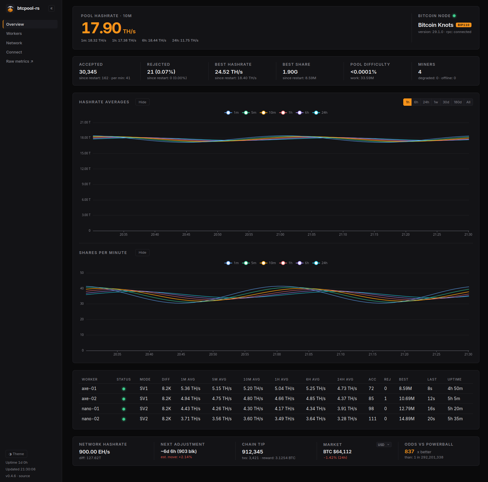

# btcpool-rs

[](https://github.com/edifus/btcpool-rs/actions/workflows/ci.yml)
[](https://github.com/edifus/btcpool-rs/actions/workflows/e2e.yml)
[](https://github.com/edifus/btcpool-rs/releases)
[](#license)
[](https://github.com/edifus/btcpool-rs)

**A solo Bitcoin mining pool that speaks both Stratum V1 and Noise-encrypted Stratum V2 on a single port.** Point any ASIC (or a Bitaxe / NerdQAxe++) at it and **100% of a found block goes to the Bitcoin address in that miner's username**. One Rust binary, one Bitcoin node, no fees, no payout splits, no accounts.

> **Lottery / solo mining**: configure each miner as `BITCOIN_ADDRESS.worker`. A block it finds pays that address directly in the coinbase; the pool only coordinates work and never takes a cut.



---

## Why this pool

If you already run an established solo-mining daemon, the honest case isn't that
this is more battle-tested. It's younger, and the [verification
section](#does-it-actually-find-and-pay-blocks-dont-trust-verify) is how you
check the part that has to be correct. The case is that it does things the older
solo daemons don't:

- **SV1 + SV2 on one port.** The protocol is auto-detected from the first byte of each connection. Legacy SV1 ASICs and modern Noise-encrypted SV2 firmware (e.g. NerdQAxe++) share the *same* host:port. No proxy, no second listener.
- **True solo.** `getblocktemplate` → the miner identity's Bitcoin address. No shares database, no PPLNS, no operator fee.
- **Self-contained.** A single Rust binary plus your Bitcoin node. Cookie auth, ZMQ block notifications, RPC-poll fallback.
- **Observable.** A live HTML dashboard (1m/5m/10m/1h/6h/24h hashrate averages, per-worker table, network difficulty + estimated next-retarget move, BIP110/RDTS signaling, probability) and a Prometheus endpoint.

---

## Does it actually find and pay blocks? (don't trust, verify)

The fair question for any young pool is *"how do I know a found block actually
gets submitted and pays my address?"* You don't have to take my word for it. The
proof is in the repo and runs on every change:

- **An end-to-end block-acceptance test runs on every PR and every push to main.** It boots a
  real `bitcoind -regtest`, launches the actual pool binary, connects over the
  live Stratum socket exactly as a miner would, grinds a real share that is also
  a valid block, submits it, and **asserts the node accepted it onto the chain
  and that the coinbase pays the address used to authorize that miner**. This is the one
  path no unit test can fake. It guards the bugs that stay invisible until a
  block is genuinely found: prev-hash byte order, BIP34 height, merkle root,
  witness commitment, and the `submitblock` path itself. See
  [`tests/block_acceptance.rs`](tests/block_acceptance.rs) and the
  [`e2e.yml`](.github/workflows/e2e.yml) workflow. A green badge above means the
  full `getblocktemplate` → coinbase → `submitblock` pipeline passed on the
  latest commit.
- **Every PR goes through CI before merge** (fmt, clippy, tests, release
  build). See [`ci.yml`](.github/workflows/ci.yml).
- **Run it yourself.** The regtest harness is one command (see
  [Development](#development)); on regtest you can mine real blocks through the
  pool in seconds. If something breaks there, that's exactly the bug report I
  want pre-1.0. Open an issue.

Short track record is fair to weigh. But the coverage is public, reproducible,
and exercised on every commit, so you can check it rather than trust it.

---

## Features

| Category | Detail |
|---|---|
| Protocol | Stratum V1 (JSON-RPC over TCP) **and** Stratum V2 (Extended Channel, Noise-encrypted), auto-detected per connection on one port |
| ASIC extensions | SV1: `version-rolling` (BIP320), `minimum-difficulty`, `subscribe-extranonce`, `mining.configure`. SV2: extended channel with BIP320 version rolling |
| Auth | Bitcoin address from the SV1 worker name or SV2 user identity (`BITCOIN_ADDRESS.worker`) |
| Difficulty | Per-miner vardiff with configurable target share time, retarget interval, and max adjustment factor |
| Block template | `getblocktemplate` via Bitcoin RPC, ZMQ `hashblock` push (RPC poll fallback) |
| Coinbase | BIP34 height, configurable tag, SegWit witness commitment, reward to the authorized miner address |
| Share validation | Header reconstruction, double-SHA256, meets-target check, duplicate detection, ntime drift check |
| Block submission | `submitblock` on valid block, immediate with latency logging |
| Security | Per-IP connection rate limiting, per-session share rate limiting (token bucket), invalid-share counting, IP ban list with TTL, message size limit |
| Metrics | Prometheus endpoint (`/metrics`): hashrate, share counts, block finds, connected miners |
| Logging | Structured JSON or human-readable via `tracing` |

---

## Quick start (Docker)

```bash
# 1. Get a config and set your node details
curl -O https://raw.githubusercontent.com/edifus/btcpool-rs/main/config.toml.example
mv config.toml.example config.toml
$EDITOR config.toml          # set bitcoin_rpc

# 2. Run (host networking lets it reach bitcoind's RPC + ZMQ on localhost).
#    The image runs as the non-root user uid:gid 10001, so it reads the cookie
#    via a supplementary group: pass your node group's GID (find it with
#    `stat -c %g "$HOME/.bitcoin/.cookie"`) and set rpccookieperms=group in
#    bitcoin.conf so the cookie is group-readable.
docker run -d --name btcpool-rs --network host \
  --group-add "$(stat -c %g "$HOME/.bitcoin/.cookie")" \
  -v "$PWD/config.toml:/app/config.toml:ro" \
  -v "$HOME/.bitcoin/.cookie:/home/btcpool/.bitcoin/.cookie:ro" \
  ghcr.io/edifus/btcpool-rs:latest
```

Or with Compose, see [`docker-compose.yml`](docker-compose.yml):

```bash
docker compose up -d
```

Then open the dashboard at `http://<host>:9090/`.

---

## Quick start (from source)

Requires **Rust ≥ 1.75** and **libzmq** (`apt-get install libzmq3-dev pkg-config`).

```bash
git clone https://github.com/edifus/btcpool-rs
cd btcpool-rs
cp config.toml.example config.toml   # edit bitcoin_rpc
cargo build --release
./target/release/btcpool-rs config.toml
```

Prebuilt Linux binaries are also attached to each [release](https://github.com/edifus/btcpool-rs/releases) (they need `libzmq5` on the host).

---

## Nix

The flake provides the package, development shell, and a NixOS service module:

```bash
nix develop
nix build
nix run -- config.toml
```

The Nix package reads its version from `Cargo.toml`, so Cargo and Nix releases
always use the same project version.

Import the NixOS module from this branch and configure the pool through
`services.btcpool-rs.settings`. The module generates
`/etc/btcpool-rs/config.toml`; unspecified values use the defaults from
`config.toml.example`.

```nix
{
  inputs.btcpool-rs.url = "github:edifus/btcpool-rs";

  outputs = { nixpkgs, btcpool-rs, ... }: {
    nixosConfigurations.pool = nixpkgs.lib.nixosSystem {
      system = "x86_64-linux";
      modules = [
        btcpool-rs.nixosModules.default
        {
          services.btcpool-rs = {
            enable = true;
            extraGroups = [ "bitcoin" ];
            openFirewall = true;
            after = [ "bitcoind.service" ];

            settings = {
              pool = {
                listen_addr = "0.0.0.0:3333";
                network = "mainnet";
              };
              bitcoin_rpc = {
                url = "http://127.0.0.1:8332";
                cookie_path = "/var/lib/bitcoind/.cookie";
              };
              metrics.prometheus_addr = "0.0.0.0:9090";
            };
          };
        }
      ];
    };
  };
}
```

Everything under `settings` ends up in the Nix store, so keep credentials out of
it. Cookie authentication is straightforward: add the Bitcoin node's
group to `extraGroups` and make sure that group can traverse the cookie's parent
directory.

For a username and password, `sops-nix` can render the environment file that the
service expects. Add it to your flake inputs:

```nix
inputs.sops-nix = {
  url = "github:Mic92/sops-nix";
  inputs.nixpkgs.follows = "nixpkgs";
};
```

Import `inputs.sops-nix.nixosModules.sops` alongside the btcpool-rs module. Then
open your encrypted secrets file with `sops secrets/btcpool-rs.yaml` and add
these keys:

```yaml
bitcoin_rpc_user: rpcuser
bitcoin_rpc_password: rpcpassword
```

Use a template to turn those keys into the application's environment overrides:

```nix
{ config, ... }:
{
  sops = {
    defaultSopsFile = ./secrets/btcpool-rs.yaml;

    secrets = {
      bitcoin_rpc_user.restartUnits = [ "btcpool-rs.service" ];
      bitcoin_rpc_password.restartUnits = [ "btcpool-rs.service" ];
    };

    templates."btcpool-rs.env" = {
      owner = config.services.btcpool-rs.user;
      group = config.services.btcpool-rs.group;
      mode = "0400";
      content = ''
        BTCPOOL_BITCOIN_RPC__USER=${config.sops.placeholder.bitcoin_rpc_user}
        BTCPOOL_BITCOIN_RPC__PASSWORD=${config.sops.placeholder.bitcoin_rpc_password}
      '';
    };
  };

  services.btcpool-rs.environmentFiles = [
    config.sops.templates."btcpool-rs.env".path
  ];
}
```

The encrypted YAML can live in the repository; the decrypted environment file
is created under `/run` and is readable only by the service user. Do not put a
password in `settings.bitcoin_rpc.password` or point `environmentFiles` at a Nix
path literal such as `./btcpool-rs.env`: either would copy the secret into the
Nix store. The module rejects the former.

The service stores its SQLite database, found-block archives, and persistent SV2
authority key under `/var/lib/btcpool-rs`; set those paths accordingly in
`services.btcpool-rs.settings`.

---

## Running as a systemd service

For a bare-metal install alongside your node, a hardened unit is provided at
[`packaging/systemd/btcpool-rs.service`](packaging/systemd/btcpool-rs.service).

```bash
# 1. Install the binary and config to standard locations
sudo install -Dm755 target/release/btcpool-rs /usr/local/bin/btcpool-rs
sudo install -Dm644 config.toml /etc/btcpool-rs/config.toml      # then edit it
#    Set stats_db_path = "/var/lib/btcpool-rs/pool_stats.sqlite" in the config.

# 2. Create a dedicated system user
sudo useradd --system --no-create-home --shell /usr/sbin/nologin btcpool

# 3. Give it read access to bitcoind's RPC cookie (pick one):
#    a) add it to the group that can read your node's data dir, and set
#       rpccookieperms=group in bitcoin.conf. The group name is whatever you use
#       for node access: bitcoind's own group, or a shared one (e.g. `bitstack`
#       covering CLN/electrum/etc.). Substitute your group below:
sudo usermod -aG <node-group> btcpool
#    b) or use explicit rpcuser/rpcpassword in config.toml (skip the cookie)

# 4. Install the unit and start it
sudo install -Dm644 packaging/systemd/btcpool-rs.service \
  /etc/systemd/system/btcpool-rs.service
sudo systemctl daemon-reload
sudo systemctl enable --now btcpool-rs
journalctl -u btcpool-rs -f
```

Logs go to the journal by default (`log_dir` empty); set `log_dir` plus
`LogsDirectory=` in the unit for file logging instead.

---

## Bitcoin node configuration (`bitcoin.conf`)

```ini
# Required: RPC
server=1
# Cookie auth is on by default; no rpcuser/rpcpassword needed

# Recommended: ZMQ for instant block notifications
zmqpubhashblock=tcp://127.0.0.1:28332

# Allow RPC from localhost (default)
rpcbind=127.0.0.1
rpcallowip=127.0.0.1
```

---

## Configuration

All settings live in `config.toml`. The essentials:

```toml
[pool]
listen_addr = "0.0.0.0:3333"
initial_difficulty = 4096                  # ~1 TH/s at 15s/share; vardiff ramps from here

[sv2]
enabled = true                             # accept SV2 on the same port (false = SV1 only)

[bitcoin_rpc]
url = "http://127.0.0.1:8332"
cookie_path = "~/.bitcoin/.cookie"         # default Bitcoin location

[zmq]
hashblock_endpoint = "tcp://127.0.0.1:28332"
poll_fallback = true                       # falls back if ZMQ unreachable
```

See [`config.toml.example`](config.toml.example) for the fully annotated reference.

### Difficulty and small / large miners

`[vardiff]` automatically tracks each miner's hashrate, but it works within a
configured floor and ceiling (`min_difficulty` / `max_difficulty`). The default
floor of **4096** suits roughly **1 TH/s and up** (a Bitaxe, Avalon Nano, or
larger) at the 15 s target share time. Two cases to know about:

- **Low-hashrate devices** (USB sticks, NerdMiner-class lottery miners, ~sub-0.3 TH/s)
  will be pinned at the floor and submit shares slowly, or for very tiny
  devices almost never. This is purely cosmetic: **share difficulty has no
  payout effect in solo mining** (you're paid on blocks, 100%, regardless), so
  such a device still finds and submits a real block normally; it just shows
  little or no hashrate on the dashboard. If you want better telemetry for small
  hardware, lower `min_difficulty`.
- **Large miners / farms** can raise `max_difficulty` so vardiff can settle them
  at a higher target instead of submitting shares faster than the 15 s goal.

Miners that send `mining.suggest_difficulty` (e.g. AxeOS's "pool difficulty"
field) are honored as a **starting** difficulty, clamped to this floor/ceiling;
vardiff takes over from there. The floor is never crossed, so a suggestion can't
push a miner below the configured share-rate floor.

Every value can also be overridden by an environment variable named
`BTCPOOL_<SECTION>__<KEY>` (double underscore between section and key), so
container platforms can inject deployment-specific settings without editing
the file:

```bash
BTCPOOL_BITCOIN_RPC__URL=http://10.0.0.5:8332 # [bitcoin_rpc] url
BTCPOOL_BITCOIN_RPC__USER=umbrel              # [bitcoin_rpc] user
BTCPOOL_SV2__ENABLED=false                    # [sv2] enabled
```

---

## Pointing your miners at the pool

### Stratum V1 (most ASICs)

| Field | Value |
|---|---|
| Pool URL | `stratum+tcp://<your-server-ip>:3333` |
| Worker | `BITCOIN_ADDRESS` or `BITCOIN_ADDRESS.worker` |
| Password | anything (ignored) |

Modern firmware (Braiins OS, LuxOS, stock AxeOS) auto-negotiates `mining.configure` and enables BIP320 version-rolling; the pool advertises mask `1fffe000`.

### Stratum V2 (e.g. NerdQAxe++)

SV2 firmware connects to the **same host and port** as SV1. The protocol is auto-detected, so there is no separate listener.

On a NerdQAxe++ (AxeOS ≥ v1.0.37):

| Field | Value |
|---|---|
| Stratum | select **Stratum V2** |
| Encryption | **on** (Noise); authority pubkey optional, see below |
| Host / Port | `<your-server-ip>` : `3333` (same as SV1) |
| Worker | `BITCOIN_ADDRESS` or `BITCOIN_ADDRESS.worker` (sent as the SV2 `user_identity`) |

The address before the first `.` must be valid for the Bitcoin network reported by the connected node. Invalid identities are rejected before the pool issues work. The connection is secured with the SV2 **Noise** handshake (pool = responder); the device then opens an **Extended Channel** and is served `NewExtendedMiningJob` + `SetNewPrevHash` from the same `getblocktemplate` pipeline as SV1. Set `enabled = false` under `[sv2]` to refuse SV2 and serve SV1 only.

**Pool identity (optional pinning).** The pool signs each connection's Noise certificate with a persistent authority key and prints the base58check public key at startup (also shown in the dashboard's Connect modal, and at `GET /api/info`). Miners that support it can pin this key to cryptographically verify they are talking to your pool; miners that leave it unset connect exactly the same, encrypted but without identity verification. The key file (`[sv2] authority_key_file`, default `sv2-authority.key`) is created on first start; `persist_authority_key = false` reverts to a fresh key per process. Both the accept and reject paths are covered by tests that run a real handshake against a pinning SRI initiator, including wrong-key and expired-certificate cases.

---

## Dashboard & metrics

With `prometheus_addr` set (default `0.0.0.0:9090`), an HTTP server exposes:

| Route | Description |
|---|---|
| `GET /` | HTML dashboard: rolling hashrate and shares/sec averages with 1h-180d ranges, workers, network difficulty + estimated next-retarget move, BIP110/RDTS signal, market data, probability, uptime (auto-refreshes) |
| `GET /stats` | JSON snapshot of current pool state |
| `GET /history` | Legacy 10-minute hashrate history (`?since=<unix-ts>`) |
| `GET /chart` | Hashrate ECharts option data (`?window=1h\|6h\|24h\|1w\|30d\|180d\|all`) |
| `GET /share-chart` | Accepted shares/sec ECharts option data, same `?window=` values |
| `GET /api/info` | Pool version, network, Stratum port, SV2 status, and authority public key |
| `GET /metrics` | Prometheus text exposition |
| `GET /health` | `200` while the block template is refreshing, `503` once it has been stale for 180s (JSON, carries `template_age_secs`) |

Key Prometheus metrics:

| Metric | Description |
|---|---|
| `pool_connected_miners` | Current live connections |
| `pool_shares_accepted_total` | Lifetime valid shares |
| `pool_shares_rejected_total{reason}` | Rejected shares by reason |
| `pool_blocks_found_total` | 🏆 Blocks that won their height |
| `pool_blocks_orphaned_total` | Blocks that won their height and were later reorged out |
| `pool_block_submissions_total{outcome}` | The node's verdict per submitted block: `accepted`, `duplicate`, `inconclusive` |
| `pool_block_confirmations_total{result}` | How the confirmation pass decided a block: `confirmed`, `orphaned`, `abandoned` |
| `pool_blocks_pending_confirmation` | Found blocks not yet decided (normally 0) |
| `pool_hashrate_hps{window}` | Pool H/s, one series per averaging window (`1m`, `5m`, `10m`, `1h`, `3h`, `6h`, `24h`) |
| `pool_worker_hashrate_hps{worker,window}` | Per-worker H/s, same windows |
| `pool_shares_per_second{window}` | Pool-wide accepted shares/s, same windows and same decay as the hashrate gauges |
| `pool_job_height` | Current template block height |
| `pool_template_last_refresh_timestamp_seconds` | Unix time of the last successful template refresh |
| `pool_tip_changes_discovered_by_timer_total` | New tips the ntime timer saw before ZMQ did |
| `pool_zmq_reconnects_total` | ZMQ listener restarts |

Hashrate gauges are decaying averages with the labelled window as their time
constant, refreshed every 2s. A freshly connected worker reads well below its
true rate on the longer windows until they have filled — the `24h` series is
still climbing a day in. Alert on `pool_hashrate_hps{window="10m"}`; it carries
no worker label, so it does not fan out with the fleet.

`pool_shares_per_second` is the same decay applied to a plain count of accepted
shares, so it measures throughput rather than work done: it drops when vardiff
retargets miners upward even though hashrate is unchanged. Prefer it over
`rate(pool_shares_accepted_total[…])` if you want the figure the dashboard
plots — the range selector there is a guess, this is not. Both the gauge and the
chart survive a restart, resuming decayed across the downtime.

`pool_blocks_found_total` counts only blocks that became the chain tip. A block
that is consensus-valid but lost a same-height race earns nothing, and lands in
`pool_block_submissions_total{outcome="inconclusive"}` instead — a non-zero rate
there means hashrate is being spent on a stale tip, usually because template
refreshes are lagging. `pool_blocks_found_total` is equivalent to
`sum(pool_block_submissions_total{outcome=~"accepted|duplicate"})`; it exists
unlabelled because it is the headline number.

That verdict comes from `submitblock` and is only true at the instant it is
read: a block that wins its height can still be reorged out. Every found block
is therefore re-checked with `getblockheader` until it is `confirmation_depth`
(default 6) deep on the active chain or that deep on a branch that lost. Blocks
that turn out to have been reorged away move `pool_blocks_orphaned_total`, so
**the blocks the pool actually kept are
`pool_blocks_found_total - pool_blocks_orphaned_total`** — a counter cannot be
decremented, so the correction is exported alongside rather than folded in. The
dashboard shows the net figure directly, and marks the last-block card when the
block it names has been reorged out. The reconciliation runs in both directions:
a block that lost its height race and is later promoted onto the active chain by
a reorg is counted then.

`pool_blocks_pending_confirmation` should sit at 0 and briefly rise to 1 after a
block. Stuck above 0 for hours means the pass cannot reach the node. The
partition `found = confirmations{confirmed} + confirmations{orphaned} +
confirmations{abandoned} + pending` holds over the process lifetime.
`abandoned` means the node stopped recognising the hash entirely for 24 h —
reindexed, restored from a snapshot, or replaced — and the submit-time verdict
was left standing.

For template freshness, alert on
`time() - pool_template_last_refresh_timestamp_seconds`. The raw timestamp is
exported rather than an age so you can pick your own threshold; `/health` uses a
fixed 180s. A rising `pool_tip_changes_discovered_by_timer_total` is the sharper
signal that ZMQ specifically has stopped delivering — it counts blocks the
30-second timer found before the notification did, so a sustained rate means the
pool is learning about new tips up to 30 seconds late.

---

## Architecture

```
ASIC / Bitaxe (SV1 or SV2)
    │ TCP :3333  (protocol auto-detected from first byte)
    ▼
network/server.rs        - accept loop, IP limits, connection cap
    │
    ├── SV1 ──▶ network/session.rs   - subscribe→auth→submit state machine
    │                                  vardiff, extension negotiation
    └── SV2 ──▶ protocol/sv2/         - Noise handshake, extended channel,
                                        NewExtendedMiningJob / SetNewPrevHash
    │
    ▼
mining/validator.rs      - header reconstruction, SHA256d, target comparison
mining/vardiff.rs        - per-session difficulty management
mining/engine.rs         - shared template store and broadcast channel
    │
    ▼
bitcoin/template.rs      - GBT → shared template → identity-bound StratumJob
bitcoin/rpc.rs           - Bitcoin RPC (cookie auth, getblocktemplate, submitblock)
bitcoin/zmq.rs           - ZMQ hashblock listener + RPC poll fallback

network/dashboard.rs     - HTTP :9090 - dashboard, /stats JSON, /metrics
```

The mining engine, validator, vardiff, and template code are protocol-agnostic; SV1 and SV2 share address-independent template data while each session receives and retains its own payout-specific jobs.

---

## Development

```bash
cargo test                        # run unit + integration tests
RUST_LOG=debug cargo run -- config.toml
cargo clippy --all-targets -- -D warnings
cargo fmt --all -- --check

# End-to-end block-acceptance test: boots a real bitcoind -regtest, mines a
# block through the pool, and requires the node to accept it (needs bitcoind +
# bitcoin-cli on PATH or via $BITCOIND / $BITCOIN_CLI).
cargo test --release --test block_acceptance -- --ignored --nocapture
```

CI runs fmt, clippy, tests, and a release build on every PR and every push to
main; the separate E2E workflow runs the block-acceptance test on the same
triggers.

See [CONTRIBUTING.md](CONTRIBUTING.md) for setup, the checks a PR must pass, and
commit/PR conventions.

## Releasing

Versioning follows [SemVer](https://semver.org/). While pre-1.0, breaking
changes bump the **minor** version and everything else bumps the **patch**
version. Changes are recorded in [CHANGELOG.md](CHANGELOG.md) under
`[Unreleased]` as they merge.

To cut a release (e.g. `v0.1.1`):

```bash
# 1. Promote the changelog: rename [Unreleased] -> [0.1.1] - <date>, add a fresh
#    empty [Unreleased], and update the compare links at the bottom.

# 2. Bump the version in Cargo.toml, then refresh Cargo.lock.
#    edit Cargo.toml:  version = "0.1.1"
cargo build

# 3. Commit the version bump + changelog together.
git add Cargo.toml Cargo.lock CHANGELOG.md
git commit -m "release: v0.1.1 - <one-line summary>"

# 4. Tag and push. The tag is what triggers the release automation.
git tag -a v0.1.1 -m "v0.1.1"
git push && git push origin v0.1.1
```

Pushing a `v*` tag triggers two workflows automatically:

- **`release.yml`** builds Linux x86_64 and aarch64 binaries on native runners,
  packages a tarball per architecture (binary + `config.toml.example` + README),
  and publishes a GitHub Release with auto-generated notes.
- **`docker.yml`** builds and pushes a multi-arch (amd64 + arm64) image to
  `ghcr.io/edifus/btcpool-rs:<tag>`.

So the only manual steps are the changelog promotion, the version bump, and the
tag push. CI produces the artifacts and the GitHub Release.

---

## License

Licensed under either of [MIT](LICENSE-MIT) or [Apache-2.0](LICENSE-APACHE) at
your option.
